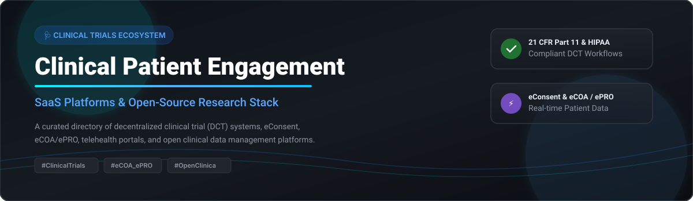

# 🩺 Awesome Clinical Patient Engagement Platform 🚀

<p align="center">
  
</p>

<p align="center">
  <a href="https://github.com/ishandutta2007/Awesome-Awesome-Awesome"></a><a href="https://discord.gg/jc4xtF58Ve"></a>
  <a href="https://github.com/ishandutta2007/Awesome-Clinical-Patient-Engagement-Platform/stargazers"></a>
  <a href="https://github.com/ishandutta2007/Awesome-Clinical-Patient-Engagement-Platform/network/members"></a>
  <a href="https://github.com/ishandutta2007/Awesome-Clinical-Patient-Engagement-Platform/issues"></a>
  <a href="https://github.com/ishandutta2007/Awesome-Clinical-Patient-Engagement-Platform/blob/main/LICENSE"></a>
  <a href="https://github.com/ishandutta2007"></a>
</p>

---

## 💡 Overview & Ecosystem Insights 📊

Welcome to the **Awesome Clinical Patient Engagement Platform** directory! This repository tracks top commercial **SaaS platforms** and **open-source software** used for **Clinical Trial Patient Engagement**, electronic Clinical Outcome Assessment (**eCOA / ePRO**), electronic Informed Consent (**eConsent**), **Decentralized Clinical Trials (DCT)**, participant retention, and digital healthcare research workflows.

### 🌐 Market Size & Industry Concentration

> **Market Valuation:** The global **Clinical Trial Patient Engagement & DCT Market** is estimated at **\$8.5 Billion to \$11.2 Billion**, projected to expand at a compound annual growth rate (CAGR) of over **14.2%** driven by remote patient monitoring, wearable telemetry, and hybrid trial models.
> 
> **Market Fragmentation:** The sector is **moderately fragmented**, undergoing rapid consolidation. While legacy life-science giants (e.g., Thermo Fisher / Clario, Signant Health) control massive enterprise clinical endpoint contracts, specialized venture-backed unicorns (e.g., Medable, Reify Health) hold significant market share in decentralized patient-facing mobile software.

---

## 📑 Table of Contents 📌

- [🏢 SaaS & Hosted Platforms](#-saas--hosted-platforms)
- [🔓 Open-Source GitHub Projects](#-open-source-github-projects)
- [🤝 How to Contribute](#-how-to-contribute)
- [☕ Support & Sponsorship](#-support--sponsorship)
- [📈 Star History](#-star-history)
- [⚠️ Disclaimer](#%EF%B8%8F-disclaimer)

---

## 🏢 SaaS & Hosted Platforms 💼

Below is a curated table of commercial SaaS patient engagement and DCT platforms, sorted by estimated company scale (revenue/valuation descending).

| Product / Platform 🚀 | Market Scale / Valuation 💰 | Starting Price 💵 | Free Tier / Trial Limit ⏳ | Key Clinical Capabilities 🛠️ |
| :--- | :--- | :--- | :--- | :--- |
| **[Clario](https://clario.com/)** | **~\$8.9B** (Acquired by Thermo Fisher for \$8.9B; ~\$1.25B Rev) | Starting at **\$15,000 / study** | **No free tier**; 14-day enterprise Sandbox trial upon request | Enterprise eCOA, patient-reported outcomes, medical imaging, & telemetry endpoints. |
| **[Reify Health](https://www.reifyhealth.com/)** | **\$4.8B Valuation** (Series D; ~\$189M Rev) | Starting at **\$12,500 / study / yr** | **No free tier**; custom 30-day investigator pilot demo for sites | Clinical trial recruitment software (StudyTeam) & site/patient engagement tools. |
| **[Medable](https://www.medable.com/)** | **\$2.1B Valuation** (Series D; ~\$95.8M Rev) | Starting at **\$10,000 / trial / mo** | **No free tier**; 30-day sandbox trial for CRO partners | Modular DCT platform offering eConsent, Televisits, eCOA/ePRO, & patient apps. |
| **[Signant Health](https://www.signanthealth.com/)** | **~\$600M Rev** (backed by Genstar Capital) | Starting at **\$8,500 / study / mo** | **No free tier**; demo walkthrough upon sponsor evaluation | eCOA, eConsent, patient engagement portals, & connected wearable sensors. |
| **[THREAD Research](https://www.threadresearch.com/)** | **~\$35M Rev** (Total funding ~\$50M) | Starting at **\$5,000 / study / mo** | **No free tier**; 14-day limited study builder preview | Full DCT architecture, eConsent, televisits, and participant retention tools. |
| **[YPrime](https://www.yprime.com/)** | **~\$72.2M Rev** (Total funding \$12.5M) | Starting at **\$4,500 / study / mo** | **No free tier**; custom trial demo for trial sponsors | Interactive eCOA, IRT, patient engagement tools, & clinical trial management. |
| **[Science 37](https://www.science37.com/)** | **\$38M Valuation** (Privatized; ~\$59M Rev) | Starting at **\$3,500 / study / mo** | **No free tier**; 14-day platform walkthrough demo | Decentralized clinical trial operating system, telemedicine, & patient recruitment. |
| **[ObvioHealth](https://www.obviohealth.com/)** | **~\$19.3M Rev** (Total funding \$46.7M) | Starting at **\$2,500 / study / mo** | **No free tier**; 14-day interactive demo upon sales contact | Patient-centric digital trial platform with continuous ePRO data capture. |
| **[Castor](https://www.castoredc.com/)** | **~\$9.9M Rev** (Total funding \$25.5M) | Starting at **\$250 / month** | **Free tier available** (Castor Essentials free for small non-commercial studies) | EDC, eConsent, ePRO/eCOA, & clinical trial automation with self-service setup. |
| **[MyTrials](https://www.mytrials.com/)** | **Private SME** (~\$5M Rev est.) | Starting at **\$1,500 / study / mo** | **No free tier**; 30-day trial for registered clinical research orgs | Clinical study workflows, participant appointment reminders, and engagement tools. |

---

## 🔓 Open-Source GitHub Projects 💻

Below are production-ready open-source platforms, frameworks, and SMART-on-FHIR repositories useful for building custom patient engagement pipelines. Sorted by GitHub Star Count (descending).

| Project Name 📦 | GitHub Star Count ⭐ | Description & Use Case 📝 |
| :--- | :--- | :--- |
| **[Open Data Kit (ODK)](https://github.com/getodk/collect)** | [](https://github.com/getodk/collect/stargazers) | Open-source mobile data collection tool heavily utilized in global clinical research & offline patient surveys. |
| **[LHC-Forms](https://github.com/lhncbc/lhc-forms)** | [](https://github.com/lhncbc/lhc-forms/stargazers) | NIH NLM widget library for rendering Web-based clinical survey forms, FHIR Questionnaires, and ePRO instruments. |
| **[OpenClinica](https://github.com/OpenClinica/OpenClinica)** | [](https://github.com/OpenClinica/OpenClinica/stargazers) | Electronic Data Capture (EDC) & clinical data management platform used globally for studies, eCRFs, and trial diaries. |
| **[SMART on FHIR Patient Portal](https://github.com/smart-on-fhir/sample-apps-stu3)** | [](https://github.com/smart-on-fhir/sample-apps-stu3/stargazers) | Sample SMART-on-FHIR applications for patient data access, survey responses, and consent authorization. |
| **[REDCap (Open Integration Tools)](https://github.com/projectredcap)** | [](https://github.com/projectredcap/stargazers) | Open modules and API tooling supporting REDCap—the institutional standard for research surveys and ePRO. |
| **[eConsent Framework Prototype](https://github.com/amida-tech)** | [](https://github.com/amida-tech/stargazers) | Open digital health modules for electronic informed consent workflows, cryptographic sign-off, and audit trails. |
| **[Arcwell Research Platform](https://github.com/arcwell)** | [](https://github.com/arcwell/stargazers) | Open clinical research platform initiative supporting eConsent, eCOA/ePRO, and patient communication. |

### 🛠️ Open-Source vs Commercial Architecture

```
[ Patient Mobile / Web App ] ──► [ Open FHIR Questionnaire / ODK ] ──► [ OpenClinica / REDCap EDC ] ──► [ Audit Trail ]
```

* **Academic & Investigator-Initiated Research:** OpenClinica, REDCap, and ODK offer cost-effective self-hosted survey engines and ePRO capture.
* **Registrational Sponsored Trials:** Commercial platforms (Medable, Clario, Signant Health, Reify) are required to satisfy 21 CFR Part 11, HIPAA compliance, system validation, and 24/7 global CRO support.

---

## 🤝 How to Contribute 📑

Contributions are very welcome! If you know of a clinical patient engagement tool, eCOA vendor, or open-source trial software:

1. 🍴 Fork the repository.
2. 📝 Add or update entries in `README.md` following the table format.
3. 🔍 Ensure descriptions, links, starting pricing, and repository star links are verified.
4. 📬 Submit a Pull Request with a clear description of your addition.

---

## ☕ Support & Sponsorship 💖

If this curated list saved you time or helped your clinical software research, please consider supporting the project!

- ⭐ **Star** this repository to increase visibility.
- 🔀 **Fork** and share with fellow researchers, CROs, and clinical software developers.
- ☕ **Buy me a coffee / Sponsor:** [GitHub Sponsor Dashboard](https://github.com/sponsors/ishandutta2007)

---

## 📈 Star History 🌟

[](https://star-history.dera.page/#ishandutta2007/Awesome-Clinical-Patient-Engagement-Platform&type=date&legend=top-left)

---

## ⚠️ Disclaimer 📜

- This repository is a **community-curated list** provided for educational and research reference only—it does not constitute financial, medical, legal, or regulatory advice.
- Commercial clinical software platforms operate in highly regulated environments (21 CFR Part 11, EU GDPR, HIPAA). Open-source tools require proper configuration and formal validation before deployment in registrational clinical trials.

---

<p align="center">
  <b>Made with ❤️ for Clinical Operations Teams, DCT Researchers, &amp; Open Digital Health Advocates.</b>
</p>
